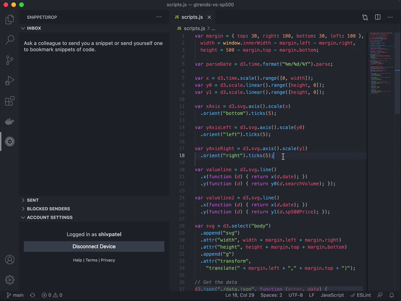

# SnippetDrop for Visual Studio Code

SnippetDrop is an end-to-end encrypted, code snippet sharing extension for VSCode. It requires a GitHub account/username.

## Installation

1. Install through VS Code extensions. Search for `SnippetDrop`.
2. Click the SnippetDrop icon in the left sidebar to open your SnippetDrop dashboard.
3. Follow on-screen instructions to login with GitHub.

## Sending Snippets

1. Select one or more lines of code.
2. Right click and select `Send Selection via Snippet Drop`.
3. Select a recent contact to send to or select `New GitHub User` to specifiy a different GitHub username.

## Receiving Snippets

1. Click the SnippetDrop icon in the left sidebar.
2. New snippets are automatically fetched every 10 seconds; you can force fetch using the refresh icon in the top right.
2. Use the on-screen `COPY` buttons to copy a snippet to your clipboard.

## End-to-End Encryption Details

- 2048 bit asymmetric RSA encryption using `node-rsa`.
- Key pairs generated locally on your device.
- **Private keys** stay on your device; **never uploaded**.
- Encrypted snippets removed from servers upon recipient download or 7 days.
- Native support for multiple VS Code workspaces per user.
- Open sourced extension and encryption implementation on GitHub.

## For Extension Development

- Clone repo
- Open repo folder in VSCode
- `npm install`
- `npm run watch` or `npm run compile`
- `F5` to start debugging

## License

GNU Affero General Public License v3.0